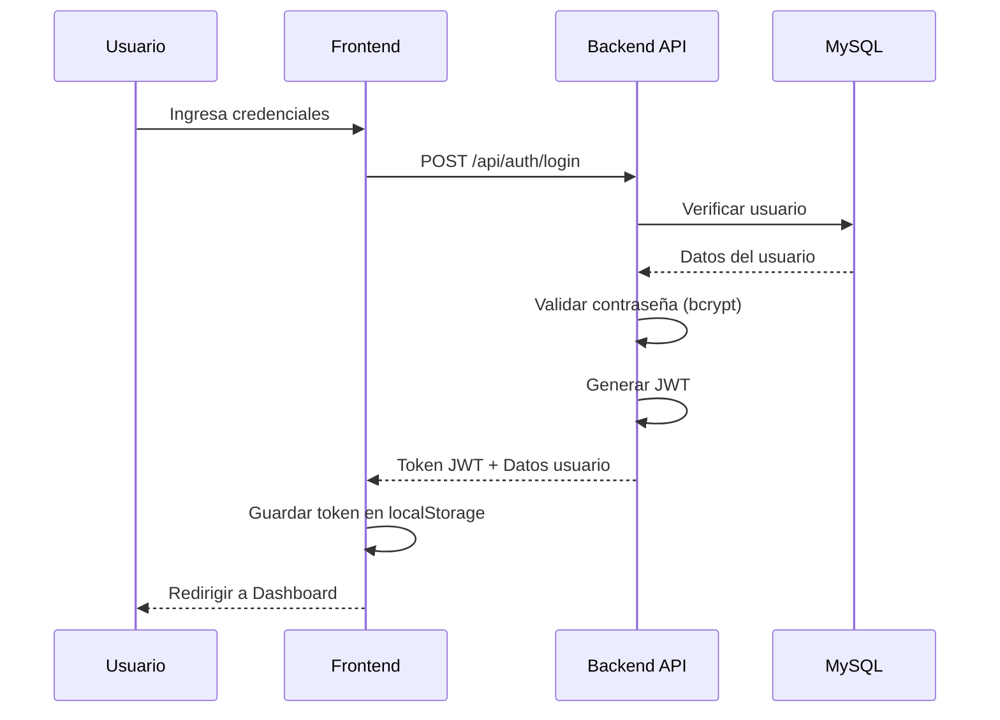
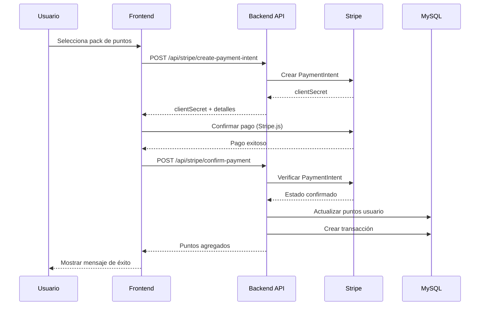
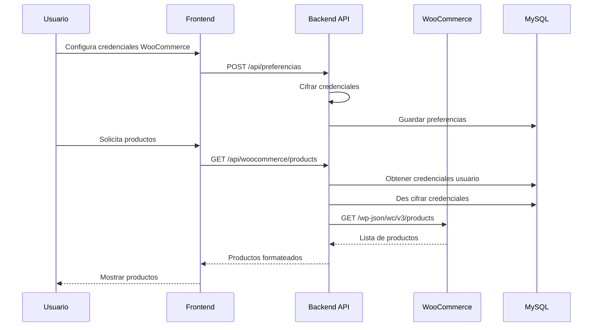
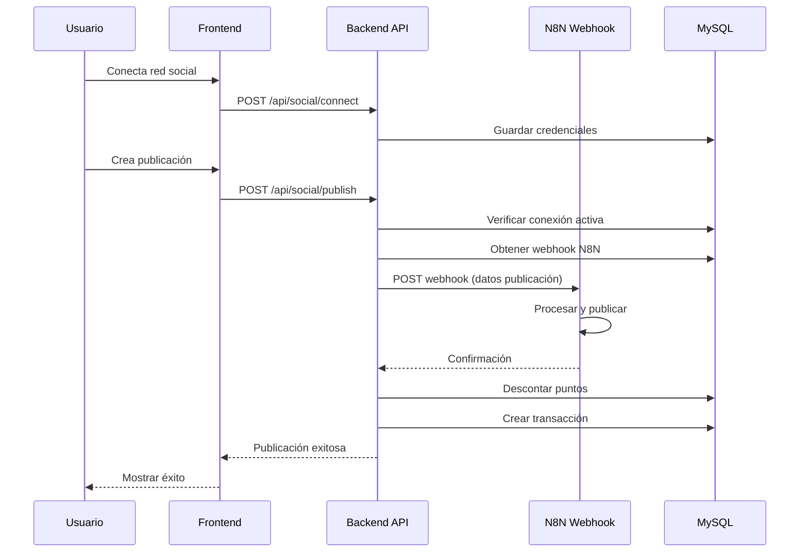
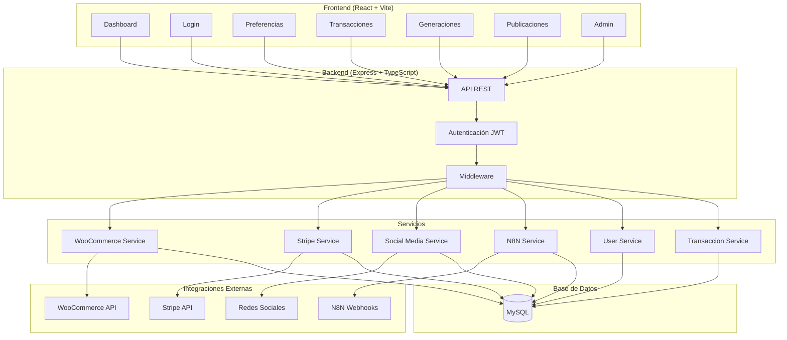

# Sistema de Tokens con N8N y WooCommerce

Un sistema completo de gestión de tokens/puntos que integra con WooCommerce, N8N, Stripe y redes sociales, construido con TypeScript, Node.js y React.

## 🚀 Características

- **Gestión de Usuarios**: Registro, login, perfil y roles (admin, usuario, moderador)
- **Sistema de Tokens**: Transacciones de puntos (compra, venta, bonificación, penalización, reembolso)
- **Integración WooCommerce**: Configuración de tienda y credenciales, listado de productos
- **Webhook N8N**: Integración con flujos de automatización
- **Pagos con Stripe**: Compra de puntos mediante Stripe (5 packs disponibles)
- **Redes Sociales**: Conexión y publicación en Instagram, Facebook, Twitter, TikTok, YouTube, LinkedIn y Pinterest
- **Base de Datos MySQL**: Sistema robusto con múltiples tablas y relaciones
- **API REST**: Backend completo con Express y TypeScript
- **Frontend React**: Interfaz moderna con Tailwind CSS y modo oscuro
- **Docker**: Configuración completa para desarrollo y producción
- **Panel de Administración**: Gestión de usuarios, estadísticas y transacciones

## 📊 Estructura de Base de Datos

### Tabla `users`
- `id` - Identificador único
- `nombre_usuario` - Nombre de usuario único
- `email` - Email único
- `contraseña_encriptada` - Contraseña hasheada con bcrypt
- `puntos` - Balance actual de puntos/tokens
- `rol` - Rol del usuario (admin, usuario, moderador)
- `fecha_creacion` - Fecha de registro
- `ultimo_login` - Último acceso

### Tabla `transacciones`
- `id` - Identificador único
- `id_usuario` - Referencia al usuario
- `tipo` - Tipo de transacción (compra, venta, bonificación, penalización, reembolso)
- `descripcion` - Descripción de la transacción
- `cantidad_puntos` - Cantidad de puntos (positivo para añadir, negativo para quitar)
- `fecha` - Fecha de la transacción

### Tabla `preferencias_usuario`
- `id` - Identificador único
- `id_usuario` - Referencia al usuario (relación 1:1)
- `cliente_key` - Consumer Key de WooCommerce (cifrado)
- `url_tienda` - URL de la tienda WooCommerce
- `cliente_secret` - Consumer Secret de WooCommerce (cifrado)
- `n8n_webhook` - URL del webhook de N8N
- `n8n_redes` - URL del webhook de N8N para redes sociales
- `fecha_creacion` - Fecha de creación
- `fecha_actualizacion` - Fecha de última actualización

### Tabla `social_media_credentials`
- `id` - Identificador único
- `id_usuario` - Referencia al usuario
- `plataforma` - Red social (instagram, facebook, twitter, tiktok, youtube, linkedin, pinterest)
- `access_token` - Token de acceso de la API
- `refresh_token` - Token de renovación
- `token_expires_at` - Fecha de expiración del token
- `app_id` - ID de la aplicación en la plataforma
- `app_secret` - Secreto de la aplicación
- `username` - Nombre de usuario en la plataforma
- `account_id` - ID de la cuenta en la plataforma
- `is_active` - Si las credenciales están activas

### Tabla `stripe_products`
- `id` - Identificador único
- `stripe_product_id` - ID del producto en Stripe
- `nombre` - Nombre del producto
- `descripcion` - Descripción del producto
- `precio` - Precio del producto
- `moneda` - Moneda del producto
- `puntos_otorgados` - Puntos que se otorgan al comprar
- `tipo_producto` - Tipo de producto
- `is_active` - Si el producto está activo

### Tabla `logs_sistema`
- `id` - Identificador único
- `id_usuario` - ID del usuario (NULL si es acción del sistema)
- `accion` - Acción realizada
- `descripcion` - Descripción detallada
- `ip_address` - Dirección IP del usuario
- `user_agent` - User Agent del navegador
- `is_done` - Si el problema ha sido resuelto
- `solucion` - Solución encontrada
- `fecha` - Fecha y hora del log

## 🔄 Flujos del Sistema

### Flujo de Autenticación



### Flujo de Compra de Puntos con Stripe



### Flujo de Integración con WooCommerce



### Flujo de Publicación en Redes Sociales



### Arquitectura General del Sistema



## 🛠️ Tecnologías Utilizadas

### Backend
- **Node.js** - Runtime de JavaScript
- **TypeScript** - Tipado estático
- **Express** - Framework web
- **MySQL 8.0** - Base de datos relacional
- **mysql2** - Cliente MySQL para Node.js
- **bcryptjs** - Encriptación de contraseñas
- **jsonwebtoken** - Autenticación JWT
- **express-validator** - Validación de datos
- **helmet** - Seguridad HTTP
- **cors** - Configuración CORS
- **express-rate-limit** - Rate limiting
- **Stripe** - Procesamiento de pagos
- **node-fetch** - Cliente HTTP

### Frontend
- **React 19** - Biblioteca de UI
- **TypeScript** - Tipado estático
- **Vite** - Herramienta de construcción
- **Tailwind CSS** - Framework de CSS
- **React Router** - Enrutamiento
- **React Hot Toast** - Notificaciones
- **React Icons** - Iconos
- **Stripe React** - Integración Stripe
- **axios** - Cliente HTTP

### DevOps
- **Docker** - Contenedorización
- **Docker Compose** - Orquestación de contenedores
- **phpMyAdmin** - Interfaz web para MySQL

## 📦 Instalación

### Opción 1: Con Docker (Recomendado)

1. **Clonar el repositorio**
   ```bash
   git clone <url-del-repositorio>
   cd woosocial
   ```

2. **Crear archivo `.env`**
   ```env
   NODE_ENV=development
   PORT=3001
   
   DB_TYPE=mysql
   DB_HOST=mysql
   DB_PORT=3306
   DB_USER=root
   DB_PASSWORD=password
   DB_NAME=token_system
   
   JWT_SECRET=tu_jwt_secret_muy_seguro_aqui
   JWT_EXPIRES_IN=24h
   
   SECRET_Stripe_API_KEY=tu_stripe_secret_key
   
   N8N_WEBHOOK_URL=http://localhost:5678/webhook
   ```

3. **Ejecutar con Docker Compose**
   ```bash
   docker compose up --build
   ```

   Esto iniciará:
   - API en `http://localhost:3001`
   - Frontend en `http://localhost:3000`
   - MySQL en puerto `3309`
   - phpMyAdmin en `http://localhost:8090`

### Opción 2: Instalación Local

1. **Clonar el repositorio**
   ```bash
   git clone <url-del-repositorio>
   cd woosocial
   ```

2. **Instalar dependencias**
   ```bash
   npm install
   ```

3. **Configurar base de datos MySQL**
   - Crear base de datos: `CREATE DATABASE token_system;`
   - Ejecutar script de inicialización: `mysql -u root -p token_system < scripts/init-db.sql`

4. **Configurar variables de entorno**
   ```env
   PORT=3001
   NODE_ENV=development
   
   DB_TYPE=mysql
   DB_HOST=localhost
   DB_PORT=3306
   DB_USER=root
   DB_PASSWORD=tu_password
   DB_NAME=token_system
   
   JWT_SECRET=tu_jwt_secret_muy_seguro_aqui
   JWT_EXPIRES_IN=24h
   
   SECRET_Stripe_API_KEY=tu_stripe_secret_key
   
   N8N_WEBHOOK_URL=http://localhost:5678/webhook
   ```

## 🚀 Uso

### Desarrollo

```bash
# Ejecutar en modo desarrollo (backend + frontend)
npm run dev

# Solo backend
npm run dev:server

# Solo frontend
npm run dev:client
```

### Producción

```bash
# Construir para producción
npm run build

# Ejecutar en producción
npm start
```

### Docker

```bash
# Desarrollo
docker compose up --build

# Producción
docker compose -f docker-compose.prod.yml up --build

# Ver logs
docker compose logs -f app

# Detener servicios
docker compose down
```

## 📡 API Endpoints

### Autenticación
- `POST /api/auth/register` - Registro de usuario
- `POST /api/auth/login` - Inicio de sesión
- `GET /api/auth/me` - Obtener usuario actual

### Usuarios
- `GET /api/users/profile` - Obtener perfil
- `PUT /api/users/profile` - Actualizar perfil
- `GET /api/users` - Listar usuarios (admin)
- `GET /api/users/:id` - Obtener usuario por ID
- `DELETE /api/users/:id` - Eliminar usuario (admin)

### Transacciones
- `GET /api/transacciones` - Listar transacciones del usuario
- `POST /api/transacciones` - Crear transacción
- `GET /api/transacciones/:id` - Obtener transacción por ID
- `DELETE /api/transacciones/:id` - Eliminar transacción
- `GET /api/transacciones/stats` - Estadísticas de transacciones
- `GET /api/transacciones/all` - Todas las transacciones (admin)

### Preferencias
- `GET /api/preferencias` - Obtener preferencias del usuario
- `POST /api/preferencias` - Crear preferencias
- `PUT /api/preferencias` - Actualizar preferencias
- `DELETE /api/preferencias` - Eliminar preferencias
- `POST /api/preferencias/test-woocommerce` - Probar conexión WooCommerce
- `POST /api/preferencias/test-n8n` - Probar webhook N8N

### WooCommerce
- `GET /api/woocommerce/products` - Listar productos
- `GET /api/woocommerce/products/:id` - Obtener producto por ID
- `POST /api/woocommerce/products` - Crear producto
- `PUT /api/woocommerce/products/:id` - Actualizar producto

### Stripe
- `GET /api/stripe/products` - Listar productos de Stripe
- `POST /api/stripe/create-payment-intent` - Crear intento de pago
- `POST /api/stripe/confirm-payment` - Confirmar pago

### Redes Sociales
- `GET /api/social` - Listar conexiones sociales
- `POST /api/social/connect` - Conectar red social
- `DELETE /api/social/disconnect/:plataforma` - Desconectar red social
- `POST /api/social/publish` - Publicar en red social
- `GET /api/social/posts` - Listar publicaciones

### N8N
- `POST /api/n8n/webhook` - Webhook para recibir eventos de N8N

## 🔧 Configuración

### WooCommerce
1. Ve a WooCommerce > Configuración > Avanzado > REST API
2. Crea una nueva clave API
3. Copia el Consumer Key y Consumer Secret
4. Configúralos en las preferencias del usuario (se cifran automáticamente)

### N8N
1. Crea un webhook en tu flujo de N8N
2. Copia la URL del webhook
3. Configúrala en las preferencias del usuario
4. Opcionalmente configura `n8n_redes` para webhooks de redes sociales

### Stripe
1. Crea una cuenta en Stripe
2. Obtén tu Secret Key desde el dashboard
3. Configúrala en la variable de entorno `SECRET_Stripe_API_KEY`
4. Crea productos en Stripe con los IDs configurados en el código

### Redes Sociales
1. Crea aplicaciones en cada plataforma que desees integrar
2. Obtén las credenciales de API (Client ID, Client Secret, etc.)
3. Conecta las cuentas desde la interfaz de usuario
4. Las credenciales se almacenan cifradas en la base de datos

## 🛡️ Seguridad

- Contraseñas encriptadas con bcrypt (salt rounds: 10)
- Autenticación JWT con expiración configurable
- Validación de datos con express-validator
- Headers de seguridad con helmet
- Rate limiting con express-rate-limit
- CORS configurado
- Credenciales cifradas en base de datos
- Protección contra SQL injection con prepared statements
- Validación de roles para endpoints administrativos

## 📁 Estructura del Proyecto

```
woosocial/
├── src/
│   ├── client/              # Frontend React
│   │   ├── components/     # Componentes reutilizables
│   │   ├── pages/          # Páginas de la aplicación
│   │   ├── hooks/          # Custom hooks
│   │   ├── services/       # Servicios del frontend
│   │   └── utils/          # Utilidades
│   ├── server.ts           # Servidor Express
│   ├── routes/             # Rutas de la API
│   ├── models/             # Modelos de datos
│   ├── services/           # Servicios del backend
│   ├── database/           # Configuración de BD
│   └── middleware/        # Middlewares
├── scripts/                # Scripts de utilidad
├── docs/                   # Documentación
├── docker-compose.yml      # Docker para desarrollo
├── docker-compose.prod.yml # Docker para producción
├── Dockerfile              # Imagen Docker
└── package.json
```

## 📝 Licencia

MIT License - ver archivo LICENSE para más detalles.

## 🤝 Contribuir

1. Fork el proyecto
2. Crea una rama para tu feature (`git checkout -b feature/AmazingFeature`)
3. Commit tus cambios (`git commit -m 'Add some AmazingFeature'`)
4. Push a la rama (`git push origin feature/AmazingFeature`)
5. Abre un Pull Request

## 📞 Soporte

Si tienes problemas o preguntas, por favor abre un issue en el repositorio.

## 📚 Documentación Adicional

- [Docker Development](docs/README-Docker-Dev.md)
- [Docker Production](docs/README-Docker-Prod.md)
- [Preferencias Implementation](docs/PREFERENCIAS_IMPLEMENTATION.md)
